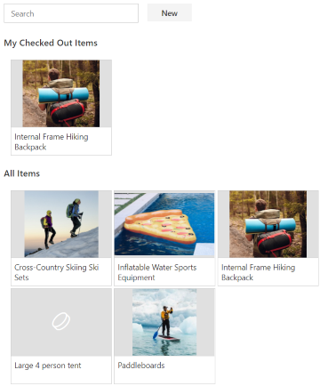

# Inventory and Check Outs

The Inventory and Checkout management part lets you manage a simple list inventory items, and build a "lending library" style check out infrastructure around them.   

The inventory web part is a single web part you can add to a web part page.  When fully configured, you can add inventory items to a list.  

Optionally, you can configure a list of locations via web part properties that lets users pick an explicit set of locations from a list.

Optionally, you can also choose to upload and link to pictures for items, so that viewers to the site can see pictures of the various items.

Users can individually view the items in the inventory list, and if they'd like, check out items from the list by clicking the checkout item button.  From there, they can input a time by which they expect to return the item.

## Used SharePoint Framework Version 

## Applies to

* [SharePoint Framework](https://dev.office.com/sharepoint)
* [Office 365 tenant](https://dev.office.com/sharepoint/docs/spfx/set-up-your-development-environment)

## Prerequisites
 
None.

## Solution

Solution                     | Author                                     			|
---------------------------- | ---------------------------------------------------- |
InventoryCheckOut            | Mike Ammerlaan (Microsoft) @mammerla                 |
InventoryCheckOut            | Todd Baginski (Microsoft MVP, Canviz) @tbag          |
InventoryCheckOut            | Alex Chen (Canviz) @alexchx  						|
InventoryCheckOut            | Luis Lu (Canviz) @stluislu   						|
InventoryCheckOut            | Theodore Shi (Canviz) @TheodoreShi                   |
InventoryCheckOut            | Max Liu (Canviz) @maxliu0621 						|
InventoryCheckOut            | Cloris Sun (Canviz) @suheart                         |
InventoryCheckOut            | Benny Zhang (Canviz)                                 |
InventoryCheckOut            | Cindy Yan (Canviz)                                   |

## Version history

Version  | Date               | Comments
-------- | ------------------ | --------
1.0      | September 27, 2017 | Initial release

## Disclaimer
**THIS CODE IS PROVIDED *AS IS* WITHOUT WARRANTY OF ANY KIND, EITHER EXPRESS OR IMPLIED, INCLUDING ANY IMPLIED WARRANTIES OF FITNESS FOR A PARTICULAR PURPOSE, MERCHANTABILITY, OR NON-INFRINGEMENT.**

---

## Minimal Path to Awesome

- Clone this repository
- Move to solution folder
- in the command line run:
  - `npm install`
  - `gulp serve`

## Features

### Installation and Configuration

When you add the web part for the first time, a user will need to create the backing lists within the site that support storage of Time Away entries.  A user with list creation permissions within the site will need to click the "Create Lists" button that shows up within the web part.

